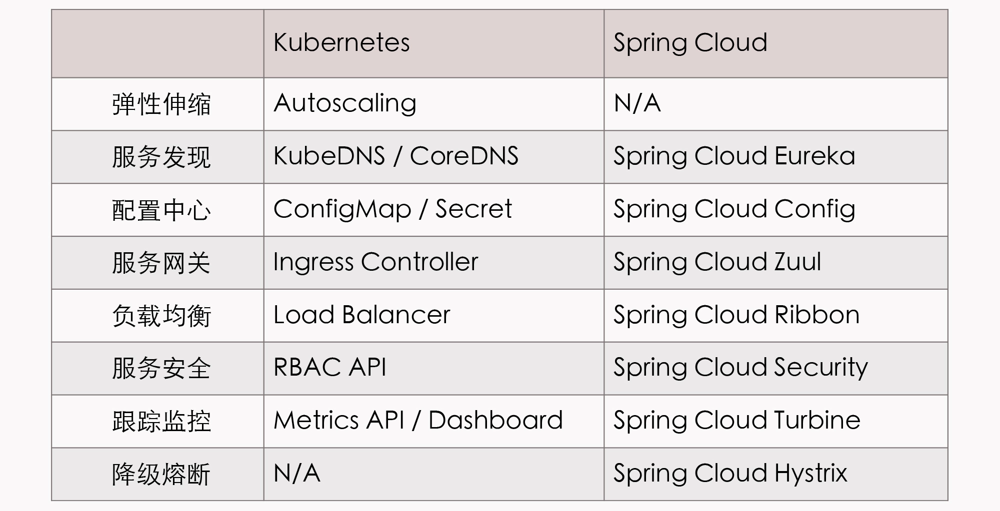
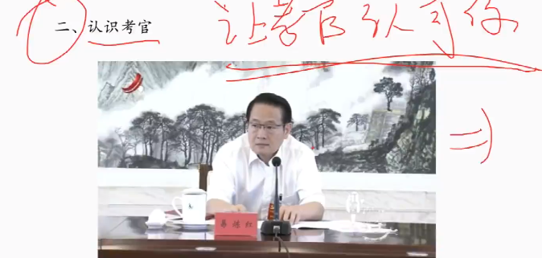

# 日记

博客部署完成 2023.12.15

* [首页](/)

* [test](/test/)

<https://docsify.js.org/#/zh-cn/quickstart>

D:\Codes\IDEAprj\java_project_study\sxh705.github.io\

# 2024年1月6日

同时开始两个项目,
这样在一个项目停止的时候可以开始进行另一个

# 2024年1月1日

powershell 不重启更新环境变量:

```powershell
[Environment]::GetEnvironmentVariable('Path', 'Machine')
```

# 2024年1月12日

架构课 <https://time.geekbang.org/opencourse/intro/100064201>

搜索技术带上`详解`两个字 这样搜出来比较系统

下午面试. 准备java八股文

11.00做饭

12.00吃饭

12.30睡觉

13.20 走 14.20 到

下午跑步

关闭网站首页显示? 浪费时间

## spring

来源: <https://javaguide.cn/system-design/framework/spring/spring-knowledge-and-questions-summary.html#spring-ioc>

### springboot aop详解 <https://www.cnblogs.com/Andya/p/12685428.html>

springboot aop:

切面: 横切多个对象的关注点的一个模块化

设置vscode字体为微软雅黑,比较舒服

提交记得写消息

### 谈谈自己对于springioc的了解

ioc将对象之间的相互依赖关系交给ioc容器来管理, 并由ioc容器完成对象的注入

可以很大程度上简化开发

### aop定义的通知类型

before 前置通知

arter 后置通知

afterReturning 返回通知

afterThrowing 异常通知

around 环绕通知

### 对springmvc的了解?

model1 页面由jsp组成

控制逻辑与表现逻辑混杂

### model2 mvc

model模型:dao和bean

jsp view视图数据:展示模型

controller处理请求 操作model

### springmvc

### 统一异常处理?

spring3.2
ControllerAdvice +
ExceptionHaldler +
ResponseBody

### spring事务传播

propagation_required
默认 加入事务/新建事务

propagation_requires_new
开启新事务

propagation_nested
嵌套事务

mandatory
嵌套或报异常

### 事务隔离级别

isolation_default 默认 可重复读

read_uncommited 读未提交 导致脏读 幻读和不可重复读

<https://blog.csdn.net/kusedexingfu/article/details/118005261>

## springboot

来源:SpringBoot 常见面试题总结.pdf

### 介绍spring

spring 是EJB的替代品 提供依赖注入和面向切面功能,用 简单Java对象(POJO, plain old java object)实现ejb功能,spring的配置是重量级的,故spring2.5引入基于注解的组件扫描,消除了大量显示xml配置,spring3引入了基于java的配置,替代xml
但是开启事务管理和springmvc还需要配置,使用可以修改的默认配置减少开发工作.springboot提供cli工具可以测试

### 什么是springboot starters?

项目依赖更简单了,开发web之前需要mvn tomcat jackson,现在只需要springbootstarterweb即可

### springboot支持哪些servlet容器

tomcat jetty undertow

### 如何使用jetty?

导入maven或者gradle配置

### 介绍springbootapplication注解

enableautoconfiguration 自动配置

componentscan 扫描类之下的所有类

configuration 允许注册额外的bean或者导入配置类

### 自动配置是如何实现的?

@enableautoconfiguration实现的, 通过 @inport注解导入autoconfigurationImportSelector类, import注解可以导入配置类或者bean,
autoconfigurationimportselector类中getcandidateconfiguration会将自动配置信息以list返回,给spring容器管理

附加题:springbean是如何被重写的?
自定义的同包同类的bean会覆盖原本的类
框架定义了ConditionalOnMissingBean注解
如果你创建了相同bean则不会自动创建了.
<https://blog.csdn.net/gzt19881123/article/details/109333230>

### rest常用注解

autowired 自动导入

restcontroller 结合了controller和responsebody
会将函数返回值填入http响应体

component 标注任意spring组件

等价于component:

@respository dao层数据库操作注解

@service 服务注解

get post put delete mapping 处理http请求

前后端传值:

requestParam 和 pathvairable:
获取查询参数(?user=1&pwd=2)和路径参数(/)

requestbody 读取request请求的body

类型默认json 会自动绑定到java对象

会使用httpmessageconverter转换.

注解详解:
<https://javaguide.cn/system-design/framework/spring/spring-common-annotations.html>

参数校验:
<https://mp.weixin.qq.com/s?__biz=Mzg2OTA0Njk0OA==&mid=2247485783&idx=1&sn=a407f3b75efa17c643407daa7fb2acd6&chksm=cea2469cf9d5cf8afbcd0a8a1c9cc4294d6805b8e01bee6f76bb2884c5bc15478e91459def49&token=292197051&lang=zh_CN#rd>

通过value注解读取简单配置信息

通过configurationProperties读取并

可以像普通bean一样注入类使用

### 通过pofileProperties校验类

### 如何进行spring监控?

springboot actuator 自带状态api

### 参数校验

@null
@notnull
@assertture
@assertfalse
@min
@max
@decimalmin
@size
@digits
@past
@future
@pattern

@notblank
@email
@length
@notempty
@range
@valid

### 定时任务?

@enablescheduing作用与启动类, 启动定时任务.

scheduled注解可以创建任务

## mysql

mysql提供哪些存储引擎:

innodb 支持事务

存储引擎是基于表的

myisam 不支持事务和行级锁

不支持安全恢复

查询缓存?

quwey cache size

任何字符不同

包括自定义函数

会导致缓存不命中

### mysql事务

#### 原子性 atomicity

事务是最小的执行单位 不允许分割
事务的原子性确保动作要么全部完成, 要么完全不起作用

#### 一致性 consistency

执行事务前后 数据保持一直
转账时 无论业务是否成功, 转账者和和收款人的总额是不变的

#### 隔离性 isolation

并发访问数据库时, 一个用户的事务不被其他事务所干扰

#### 持久性

一个事务被提交后, 它对数据库中数据的改变是持久的 即使数据库故障也不应该对其有任何影响

### 并发事务问题

脏读: dirty read
数据修改未提交时被访问了

丢失修改
事务的修改导致第一个事务的修改被覆盖

不可重复读
事务的事务过程中两次读取的数据不同

幻读
事务中第二次修改导致不存在的记录产生

### mysql的隔离

通过锁和mvcc机制实现

## java

### 为什么编译与解释并存?

编译型语言会通过贬义词一次性编译成可被平台执行的机器码,执行速度快,开发效率低 c c++ rust

解释型语言会通过解释器解释执行 python JavaScript php等

java既有编译特征也有解释特性

### 成员变量和局部变量?

成员变量是属于类的, 局部变量是在代码块或方法中定义的变量

对象存在于堆, 局部变量存在于栈

### 重载和重写的区别?

重载就是一个方法能根据输入不同做不同处理

重写是子类覆盖父类方法.

### 可变参数

作为函数的最后一个参数.

在编译时转换为数组.

### 基本类型

byte short int long float double
char
boolean

### 自动装箱?

Integer i = 10 装箱
int j = i 拆箱

尽量避免大量拆箱装箱操作, 这样会生成大量对象

### 浮点精度维问题, 超过long的数据?

二进制截断

使用BigDecimal和BigInteger

### 没有构造函数的类?

会自动添加 默认构造函数

### 面向对象的三大特点

#### 封装

把对象的状态隐藏在对象内部, 不允许外部直接访问, 但是提供方法来操作,如果属性不想提供就不提供.

#### 继承

不同类型的对象,有一定共同点,

1. 子类拥有父类的属性 父类的私有属性子类不能访问

2. 子类可以对父类拓展

3. 子类可以用自己的方式实现父类方法

(组合优于继承, 因为继承会带来不必要耦合性?)

实现接口比较好. 接口特性的组合

具体: <https://blog.csdn.net/fuzhongmin05/article/details/108646872>

#### 多态

一个对象具有多种状态, 父类的引用指向子类的实例.

对象类型和引用类型有继承和实现的关系

### 深拷贝和浅拷贝?

浅拷贝会在堆创建一个新对象

深拷贝会复制整个对象和内部对象.

### == 和 equals

== 比较地址

equals 比较值

## 多线程

### 虚拟线程

使用虚拟线程需要避免同步块和同步方法:
<https://blog.fastthread.io/2023/02/28/pitfalls-to-avoid-when-switching-to-virtual-threads/>

使用reentrantlock替代

## 设计模式

### 创建型

创建对象的同时隐藏创建逻辑 不用new实例化对象

* 工厂模式

  * 抽象工厂

    通过产品接口实现增加产品

* 单例模式

一个单例一个实例, 减少开销

懒加载 使用时创建对象, 私有化构造方法.

懒加载 + 同步锁 + 双重验证, 线程安全

* 建造者模式

* 原型模式

### 结构型

通过类和接口继承创建复杂对象

* 适配器

* 桥接

* 过滤器

* 外观

* 享元

* 代理

### 行为型

* 责任链

* 命名

* 解释器

* 迭代器

* 中介者

* 备忘录

* 观察者

* 状态

* 策略

* 模板

* 访问者

问题: 面试取消了

任务: 继续学习java八股, 架构.

## 周志明的软件架构课_1

<https://time.geekbang.org/column/article/337708>

### 开篇词

5个模块

演进中的架构: 架构设计的本质

架构师的视角: 架构师思考的问题, 主流方案的特点

分布式的基石: 聚焦在分布式架构,

不可变基础设施: 按照云原生时代"基础设施即代码"的新思路,带你深入理解基础设施不变性的目的

探索与实践: 开发不同架构的Fenix's Bookstore, 并看看不同环境的部署

深入理解java虚拟机...

### 什么是The Fenix Project

探索与实践, 开发不同架构的Fenix's BookStore

来源: 布道与分享

#### 软件架构探索

phoneix 凤凰 软件工厂产物

出错是正常的

人员还是架构?

人员 过程 产出物的能力和质量?

整体流程和架构?

前者为术 后者为道

学习语言 框架 spring java vue.js

复杂程序

架构方法

单体 微服务 服务网络 无服务 云原生

都是抽象的架构方法

### 可靠的系统

构建一个大规模但依然可靠的软件系统, 是否可行?

碰到不靠谱的人员 代码 硬件和网络

误差会不断累计叠加导致结果不能稳定

1940 自复制自动机?

用不可靠的部件构造可靠的系统?

分子和细胞不可靠 但是 生命依然迭代

在微生态中, 每一个部件都会老去, 但总会重生.

软件架构风格:

大型机-> 多层单体-> 分布式-> 微服务 -> 服务网格
-> 无服务

从宏观来看 架构演变最重要的驱动力不是性能

是方便某个服务能够顺利的死去与重生 而设计的

软件的缺陷不会遵循停机计划, 不会被安排出错的原因

无服务就架构视角

微服务架构的视角

如果每个部件都符合phoneix特性,

即便部件3分钟就会崩溃

但是架构设计有恰当而自动的熔断, 淘汰, 重建机制

它整体上仍然表现稳定和健壮的服务能力

PetStore 项目

Fenix's BookStore

复杂的技术是为了演示技术

### 原始分布式时代 unix设计哲学下的服务探索

架构不是发明, 而是进化的结果

> 保持接口与实现的简单性, 比系统其他任何属性, 包括准确性,一致性和完整性, 都来的更加重要

分布式架构的目标是使用多个独立的分布式服务, 构建大型的分布式系统

微型计算机系统 16位寻址 5MHz处理器 128KB内存地址空间

因为当时计算机硬件处理能力薄弱 达到最大规模

惠普: nca 网络计算架构

卡梅隆大学: afs 文件系统

麻省理工: kerberos 协议

为了避免unix的版本战争, osf共同制定了分布式运算环境公约

让开发人员不需要知道服务是在本地还是远程

不可兼顾 简单 透明 性能 正确 鲁棒

#### 要解决的问题

服务在哪里 服务发现

多少个 负载均衡

分区出错怎么办 熔断 隔离 降级

参数和返回怎么办 序列化协议

如何传输 传输协议

权限认证 认证 授权

通信安全 网络安全层

令调用不同机器的服务返回相同结果 分布式数据一致性

考虑到性能差异, 无法忽略分布式和本地的鸿沟..

刻意构造长时间运行的方法很麻烦, 与初衷矛盾

编码, 部署和运行效率都有天壤之别...

> ust because something can be distributed doesn’t mean it should be distributed. Trying to make a distributed call act like a local call always ends in tears.
>某个功能能够进行分布式，并不意味着它就应该进行分布式，强行追求透明的分布式操作，只会自寻苦果。

20世纪80年代 硬件性能2年增长一倍
信息系统进入了单体时代

### 单体系统时代

单体架构为何在想当长的时间内成为主流?

`巨石系统` 很难找到单体文章,

在想当长的时间内, 软件架构都是单体的

误区: 单体架构是落后的系统架构, 最终会被微服务所取代

必须是软件的性能超过单机的系统, 才是需要改变的单体系统.

monolithc 巨石 也不是铁板一块

不可拆分, 难以拓展?

从纵向角度, 大部分大型系统都是分层架构.

外部请求会在各层之间, 以不同形式的数据结构进行流转传递, 在末端数据库触及后一次返回响应..

单词系统并不意味着一个程序, 也可以拆分不同的程序

#### 非独立的单体

单体存在隔离与自治能力的欠缺

一旦架构出现了内存泄漏, 线程爆炸, 阻塞, 死循环问题

都会影响整个程序的工作, 无法单独更新一部分的代码

共享同样进程获得简单和高效

但是损失了功能的自治和隔离能力,

哪个更重要呢

当规模小时, 部署在一起的子系统是优势

但是规模扩大时, 迁移成本会变得很高.

单词系统无法构建7x24不间断可靠系统

从 尽量不出错 -> 出错是必然

soa时代 面向服务的系统拆分.

### soa时代 成功理论与失败实践

soa没有成为普适的软件架构

1. 烟囱式挂钩 系统之间不会进行互操作,

    两个不交互的系统, 可以拆分

    但是系统之间总会有交互

2. 微内核架构

    所有主数据集中在一块, 具体的业务系统以插件模块存在,

    插件是相互透明的, 插件只会访问内核中的公共资源?

    子系统不能互相通信

3. 事件驱动架构

    从管道发送和接收消息, 每个消息的处理者都是高度解耦的

    SOA架构时代的探索..

    出现了服务的松耦合 注册 发现 治理 编排等

    Open CSA组织

    服务的松耦合 注册 发现 治理 隔离 编排等

    具体的探索:

    更具体: soa是抽象概念, 但是更有可操作性

    基础平台: soa有技术组织open csa

    设计指导原则 封装性 自治 松耦合 可重用 可组合 无状态

    在体系化, 精密写作的技术组件支持下, soa解决了服务注册发现, 隔离治理的技术问题

    soa的精密流程和理论, 过于艰难难懂, 难以成为广泛普适性的软件架构风格.

    构建在webService基础之上的ESB BPM SCA SDO的诸多上层建筑, 进一步加剧了复杂性

    ejb当年作为企业级javabean 仍然被spring hibernate打败了

    分布式时代距离透明越来越远了.

### 微服务时代 soa的革命者

专注于单一职责的 与语言无关的 细粒度的web服务

2005年被提出

2012单一职责 康威定理 自动拓展 领域驱动

重拾unix设计哲学

2014 微服务的真正起源

微服务是一种通过多个小型服务的组合 构建单个应用的架构风格, 这些服务会围绕业务能力而非特定的技术标准来构建,各个服务可以采用不同的编程语言, 不同的数据存储技术, 运行在不同的进程之中, 服务会采取轻量的通讯与自动化的部署机制, 实现通讯与运维

微服务的核心思想:

1. 围绕业务能力构建

    有怎样的规模和能力的团队 就会产生怎样的产品

    当团队和产品稳定后 就会有一致的结构

2. 分散治理

    微服务对应的开发团队, 有直接对服务运行质量负责的责任

3. 通过服务来实现独立自治的组件

    服务是进程化的组件, 远程服务调用成本高昂, 但是是为组件带来隔离与自治能力的代价

4. 产品化思维

    软件研发不是完成某种功能, 而是作为一个持续改进, 提升的过程

5. 数据去中心化

    数据应该按领域来分散管理, 更新, 维护和存储.

6. 轻量级通讯机制

    弱管道机制, 很多服务只是强加进来的负担

    restful风格通讯是比较适合的

7. 容错性设计

    可以通过快速的故障检测, 进行及时的隔离和联通

    可靠的系统可以由出错的服务来组成

8. 演进式设计

    一个良好设计的服务, 是可以被报废的

9. 基础设施自动化

    CI/CD的发展, 降低构建, 发布, 运维工作的复杂度.

> This common manifestation of SOA has led some microservice advocates to reject the SOA label entirely, although others consider microservices to be one form of SOA , perhaps service orientation done right. Either way, the fact that SOA means such different things means it’s valuable to have a term that more crisply defines this architectural style.
> 由于与 SOA 具有一致的表现形式，这让微服务的支持者更加迫切地拒绝再被打上 SOA 的标签。一些人坚持认为微服务就是 SOA 的一种变体，尽管仅从面向服务这个角度来考虑，这个观点可以说也是正确的。但无论如何，从整体上看 SOA 与微服务都是两种不同的东西。也因此，使用一个别的名称，来简明地定义这种架构风格就显得非常有必要了。—— Martin Fowler / James Lewis，Microservices

服务通讯, 进入候选清单的就很多了..

服务发现

解决方案太多了...

一个简单的服务, 不会同时面临分布式中的所有问题

springcloud的工具集, 通过统一接口, 屏蔽了复杂度

架构者的第一职责是做决策权衡

我的产品适合微服务架构吗?

### 后微服务时代_上

微服务时代都没法完全避免服务注册 跟踪 负载 传输的问题

扩容: 多部署

负载均衡: 恰当的算法

安全传输: tls链路 ca证书

服务发现: dns服务器 访问记录而不是ip地址

基本上都出现了专职的基础设施解决这些问题了

但是硬件构成的基础设施, 跟不上软件构成的应用服务的灵活性

而注册发现, 跟踪治理问题的解决, 依赖虚拟化和容器化技术

微服务的成就, 离不开docker容器化技术的贡献..

早期: 软件定义网络 软件定义存储

但是2017 最终 kubernetes 赢得了容器战争.

spring cloud 的应用解决方案

kubernetes的基础设施层面解决方案



云原生时代 与业务无关的技术问题, 在硬件基础设施内被解决掉..

k8s 并没有完美解决全部的分布式问题

因为一些问题处于应用系统与基础设施的边缘,

我们很难精细化的解决掉他们

例如 服务A 调用了 服务B 的两个服务 B1 B2

其中B2 出现连续报错,

如果对A-B进行熔断, 则

# 2024年1月13日

autocad弹出lincense解决办法:
<https://www.moxingzu.com/a/2020-02-05/113598.html>

已重命名为 AcWebBrowser.bak.exe

## git详解

<https://www.liaoxuefeng.com/wiki/896043488029600>

### 后微服务时代_下

基础设施的力度比较粗犷

dns不能满足额外需求的负载均衡

引入 服务网格 边车代理模式

微服务注入一个通讯代理服务器

接管所有对外通讯

不需要在应用层附带代码

对应用是透明的, 在不改变软件代码的情况下实现服务治理.

容器化对软件架构, 开发的改变

服务网格

istio envoy

smart endpoints

业务与技术完全分离..

远程与本地完全透明

微服务只需要考虑业务本身逻辑..

## 周志明的软件架构课_2

<https://time.geekbang.org/column/article/337708>

### 无服务架构

分布式架构带来的新问题

服务的安全 容错 事务一致性

不去做分布式无疑是最简单的.

AWS 阿里云等云服务商都能在算力上满足系统对性能的需求

iron.in提出无服务概念

卖点: 只设计了后端设施和函数两种内容..

后端设施指数据库 消息队列 日志 存储这些支撑业务 本身无业务含义的技术组件

无服务函数运行于云端, 不考虑算力和容量规划

1. 不需要考虑组件 组件是提供的

2. 不需要考虑部署 部署是自动的

3. 不考虑算力 算力是无限的

4. 不需要担心运维 运维是服务商的责任

无服务的冷启动 无状态 运行时间有限等

它不是普适性的架构模式

无服务是短连接, 无状态, 适合事件驱动的交互形式..

无服务的无限算力决定其按使用量付费,

函数响应时间不会太好..

封装了服务的维护流程..

## 模块二 架构师的视角

### 07 远程服务调用 上 本地到远程的桥梁

架构师: 软件系统中技术模型的系统设计者

RPC的常见问题.

#### 进程间通讯

本地方法调用过程

* 传递方法参数 压栈

* 确定方法位置 找到Callee

* 执行被调方法

* 返回执行结果

本地转远程障碍

* 没有栈空间

* 语言实现不同

解决交换数据的问题:

管道

| ps的标准输出 pipleine

* 信号

singal

* 信号量

特殊变量

* 消息队列

适合大量消息传递

* 共享内存

共享内存空间 配合信号量

* IPC Socket 本地套接字接口

普适的Linux进程间通信机制

RPS应该是高层次的语言层工具

而不是IPC那样 底层地的 系统层次的特征

RPC很多学习了IPC的概念

Fragment 字段是url #后面的字段信息

可以用于做文档内跳转

java字段校验: 使用Java Bean Validation

@Null、@NotNull、@AssertTrue、@AssertFalse、@Min、@Max、@DecimalMin、@DecimalMax、@Negative、@NegativeOrZero、@Positive、@PositiveOrZeor、@Szie、@Digits、@Pass、@PassOrPresent、@Future、@FutureOrPresent、@Pattern、@NotEmpty、@NotBlank、@Email

<https://time.geekbang.org/column/article/336798>

## 分布式基石

### 共识算法

Paxos算法

# 2024年1月14日

2024年1月14日10:36:21

折腾GraalVm Native-Image

此文件为作为全局变量安装

第一步寻找gu.exe

切换到目录

```bash
cd C:\Users\23629\scoop\apps\graalvm22-jdk17\22.3.2\lib\installer\bin
 .\gu.exe list
```

找native image工具包:

<https://github.com/graalvm/graalvm-ce-builds/releases?q=22.3.2&expanded=true>

在release界面搜索native-image-installable-svm-java17-windows-amd64

<https://www.cnblogs.com/qiyebao/p/14351599.html>

<https://blog.csdn.net/wangpaiblog/article/details/122422987>

native-image -jar JAR 包的路径 打包命令

放弃了, java的依赖问题不是好解决的

相信后人的智慧... 哈哈

继续周志明架构课

## 周志明的软件架构课_3

<https://time.geekbang.org/column/article/337708>

课程答题记录 爬虫

```js
let a = []
document.querySelectorAll('.paper-item-cotainer').forEach(res => {a.push(res.innerText)})
/*
只回复"正确", 或者"错误"
([^\n]*\n[^\n]*\n[^\n]*\n[^\n]*\n[^\n]*\n)
\n\n\n\n\n只回复正确选项, 不需要任何解释, 我接下来的五个问题是: \n $1
*/
```

# 2024年1月15日

## 考研

中公考研 时间线

二月中下旬 出成绩

三月中旬 国家线

中间10天

准备复试课程, 查看网课

三月底到四月底之间一个多月

复试时间 调剂时间

整个过程全部结束

复试打卡群

中公网课, 66的课程, 资料包, 复试问题大全

## 国考

成绩已出 2024年1月15日

行测60.1 申论46 专业课62 综合成绩56.44进入面试, 排名未知.

## 公务员 结构化面试学习

<https://www.bilibili.com/video/BV1hZ4y1d78A>

国考面试行政执法可以作为一般的国考面试对待.

考虑自身的排名意义不大..

### 四条共性

* 根本: 怎么解决问题

解决问题的细节 不要糊弄

* 解决问题结构化, 清晰

列出1234点, 思路清晰

结构合理, 精心设计答题结构 对不同的问法进行调整,

审题

* 纵向观点 准确鲜明

领导讲话 提高思想认识 层层压实责任

让阅卷人抓取结构, 答题点

准确解决必要性的问题, 鲜明解决好不好的问题

爱护眼睛一样, 爱护自己的名节操守

* 横向展开, 干净充实

条理清楚, 控制语言和要素

内容不要干巴巴的都是理论, 没有鲜活素材

### 差异性

因时制宜 因事制宜 不要模板

* 平衡原则性和灵活性

执法需要原则, 也需要灵活

原则比灵活更重要, 不能随便让步

* 平衡好力度和温度

力度 坚决执行 不能通融

温度 不是冷冰冰的 有温暖

* 平衡好当机立断和严格程序

具体工作: 事前请示 事中请示 事后请示

答题: 请示一次即可

两害相权取其轻, 没有程序万不得已 当机立断

避免等靠要

* 平衡目的和方法

目的是一个 方法是灵活多变的 不要一根筋,

* 平衡好执法质量和执法效率

铁案如山, 但是效率也高

* 平衡好预防和惩治

惩治不是目的, 最好先宣传 抓少抓小, 动则责咎

* 平衡好治标和治本

不敢腐 对法律有敬畏感

不能腐 规则纪律

不想腐 道德引导

营造风清气正的社会环境

* 平衡好态度和语言

执行 违法必究执法必严

讲述 态度好, 不要加大执法成本

* 平衡法律效果和社会效果

法律讲究社会效果, 政治效果, 讲究人心

* 平衡法律问题和社会问题

处理法律问题, 考虑社会问题

不能仅仅考虑法律, 还要考虑社会问题,

### 执法特点

* 公平

没有不公平的现象

* 公开

对公众公开

* 公正

天平一定要公正

* 正义

最朴素的价值观

* 规范

严格依据相关程序, 对各种行业规范

* 程序

坚决汇报, 执行到位, 可以暂时省略繁琐的程序

* 原则

严格执法 严格立法

法律没有权威会形成陷阱

* 执行

法律的生命力来自于执行

法律的刚性必须发挥

## 行政执法岗面试备考指南

<https://www.bilibili.com/video/BV1pk4y1b783/?spm_id_from=333.337.search-card.all.click&vd_source=6fee5888cff5ab9e8fd8044b2f953fa7>

### 备考分析 行政执法

* 是什么

行政执法岗

* 考什么

对社会现象的认知能力

对实际问题的解决能力

* 如何备考

六种提醒: .

感觉有点啰嗦, 之后再说吧

## 小马哥结构化面试基础课

<https://www.bilibili.com/video/BV1Tb4y167ZV/?spm_id_from=333.788.recommend_more_video.0&vd_source=6fee5888cff5ab9e8fd8044b2f953fa7>

结构化面试理论课

### 内容: 答题思路 面试注意事项

刷题练题讲题

* 好心态 不要患得患失 不考虑捷径

    守擂 领先十分 机会比较大

    攻擂 落后十分 30% 机会

    落后46分 积累经验, 好好学 没什么参考性

    下次有机会

    也许体检没过 上岸不去

* 开口答题比听课重要

    你不是来听课的评委 不是评论课程来的

    答题更重要

    线上不比线下差, 和别人对练

    有收获的同学都经过了大量的练习

### 正式课程

介绍

#### 认识考试

##### 面试是什么?

是通过面对面的**交流** **选拔人才**的考试

交流感: 和考官的互动 语言 表情 语句

不是答题机器

文化水平高不高, 会不会做事

##### 面试考什么?

###### 综合分析题一综合分析能力

* 社会现象

* 政策行为

* 名言警句 (习语)

习近平的话

* 漫画 (湖南)

* 串词 演讲 (其他) 名言警句变形

###### 自我认知题一岗位匹配程度

几乎不考

个人的自我介绍, 优势劣势

一般结构化面试不能透露个人信息

###### 人际关系题一人际沟通能力 做人

基本上是常规题型

比例下降了, 但是以情景管理题再现

如何劝说小张 小王..

怎么称呼是补充, 根本是认识领导同事 自己 群众的定位和关系

处理人际与工作的关系

提高对人际关系的重视程度, 想法要成熟

有良好的职场心态, 做人是先天性的.

###### 组织管理题一组织协调能力 做事

调研, 宣传, 活动, 会议

效果是最重要的

中规中矩 类似的模板

从考情和培训来看

1. 注意创意
    不能一点想法没有
2. 处理细节

微操能力 细节处理

###### 应急应变题一应急应变能力 看事情

不确定性

村里房子塌了

会场爆满 措手不及

多做不同的题目

场景来自于实际工作

###### 上述四类是主流 题型

四道题 或者 三道题

###### 实务处理题一实务处理能力

乡镇类, 河南, 乡镇实务工作

###### 其它一思维与表达能力

开放类题型

#### 认识考官

考试目的: 让考官认可你



考场考官就是单位领导

一般结构化会有7位考官

5-10年会出现大量女考官

考官严肃可能是个人风格

* 主观与客观并存

    外在 颜值 个人风格 精神面貌

    内容 讲道理 自身的思考

* 任他“嬉笑怒骂”，做好自己

    不理你: 影响考生心态 可能是累了 坐一天 一天一套题

    不要因为考官状态影响自己

    两三个人答完就听腻了

    10点30之后进入考场, 一般考试时间15分钟一次

    上午10.30以后, 下午4.00之后

    答题不要太啰嗦

    考官容易犯困

* 交流感：语言、表情、眼神

    小王 小张

    给他点个大大的赞!(兴奋)

    微表情, 不要哈哈大笑 要微笑 不绝对

    要像个活人

    眼神: 紧张 自信

* 考官也是人：当作一位自己尊敬的领导或老师

#### 认识对手

#### 认识规则

#### 如何备考

## 中断

### 电话 北京太数据 数据开发 数据分析

没有经验 培训可以接受

培训8-10周 2个月

第一年包吃住 第二年1万2.

### 中断 和我妈商量

A: 拒绝大数据岗位(不重要)

B: 协商事件: 考试不及格, 继续追溯?

中断结束 打电话..

### 联系冯梓洋

# 2024年1月18日 10.37

## notepad++操作

视图->总在最前.

字体: consolas with yahei
<https://github.com/crvdgc/Consolas-with-Yahei/>

## 结构化面试

### 人际关系题

#### 人际关系1-换岗

问题

你和小王轮岗 你到新部门后, 领导经常叫小王来处理本属于你工作职责的事, 而只给你安排一些琐事, 你怎么办?

回答

各位考官 开始答题

到达 单位 之后,
我 小王 换岗,
这种方式 是一种比较好的工作方式
本质上 培训
增强能力 综合素质 业务了解
对自身很好
有利于 单位内合作 了解工作
合作顺畅
事情很好

我到达新部门 面对新领导同事 环境 能力
需要成长适应
短时间无法成长
关键性工作无法保质保量

领导认为小王去做有把握
完成度 质量 过关 确保
做了安排
我的态度 应该理解
行为上明白 职责是我的
我要成长

因此
第一 把领导琐事 事无巨细做好
发通知 打印材料 高标准做好
增加了解对我 熟悉工作和同事
提前做好

第二 对于职责内事情 在做好的基础上 有更多时间协助小王, 向他学习, 尽快掌握职责内
考虑到小王在我岗位, 我可以分享一下工作经验
或许对他也有帮助

第三 工作及时汇报 问题请示
随能力提升 领导了解

职责内的事情是自然而然的事情
我相信随着我的成长,
我也会在这个新的部门
把工作完成好
也成长的越来越好

考生作答完毕

* 人际关系1 换岗
     * 注意
          * 原则 工作角度思考安排
          * 抽象表述具体化
               * 新的部门
          * 解释领导行为合理性

     * 看法(从前到后
          * 互换轮岗好处
               * 是什么: 常规工作机制 培训机会
               * 能力: 增强综合素质 提高工作能力, 拓宽工作广度
               * 合作: 有助于理解 交流顺畅
          * 新部门: 新的工作流程 要求, 需要适应
          * 安排小王, 琐事
               * 领导保证工作完成度 理解

     * 办法
          * 办事
               * 珍惜轮岗机会 办好琐事
               * 尽快高效完成琐事 尽善尽美
          *  办人
               * 小王
                    * 协助小王 观察学习
               * 领导
    *多汇报请示, 增加对我了解, 向领导学习

     * 总结
          * 我相信 正确看待 做好职责 逐步成长

### 2-紧急工作

领导让你和小李共同去完成一项工作, 工作很紧急, 需要在三天内完成, 但小李近期想要休假备考研究生考试, 考试一周后开始, 你怎么办?

* 2-紧急工作

     * 分析
          * 错误认识
               * 废话 对我信任 理解过度
          * 责任意识
               * 负责 我们是第一责任人
               * 需要 我和小李通力合作 高效完成(时间紧张)
          * 考研考试
               * 错误认识
                    * 让小李请假 不让请假
                    * 你承担不了 这个责任 决定权不在你
               * 如果是我的话 以工作为重
               * 但是, 这是小李私事 我无法决定的 领导有决定权(你的动作取决于小李和领导)
                    * 领导让他休假
                         * 错误 让领导安排人员
                    * 领导不让他休假
                         * 关照小李

     * 看法
          * 领导让小李和我完成 我和小李应该通力合作 是第一责任人 工作紧急, 需要我们加班加点, 不容耽搁的

     * 办法
          * 但是小李准备参加研究生考试, 如果我碰到这种情况, 我会坚持工作第一
          * 但是我们是同事关系, 研究生考试是有自己的价值的, 我无法干涉, 我只能让他尽快和领导提休假的事
          * 如果领导认为有人手, 考研很重要, 我们的领导会给小李休假, 我要做的是 当领导安排小刘或其他同事, 一起与他交流好工作的进展, 把工作完成好
          * 如果人手紧张, 领导认为小李还有好几天时间, 不回去批假, 我要做的是, 关注小李的情绪, 如果小李有误会的话, 我们可以做一些解释工作 让其投入, 我也会尽力承担, 让小李轻松一点
     * 总结
          * 确保工作完成, 保质保量, 不打折扣

导图示例

* 人际关系3
     * 注意
          * 同事身份 不能决定批假 x我会让小李
 
     * 看法
          * 应该合作
               * 第一负责人
          * 工作紧急
               * 需要全身心 高效投入 考试有影响
   
     * 办法
          * 如果是我 工作第一 剩余时间备考
          * 但是不能决定同事私事, 建议尽快决定
               * 如果批假
                    * 领导态度 认可提高个人价值
                    * 工作 对接其他同事
               * 人手不足 不批
                    * 小王有情绪
                         * 解释
                              * 领导对事不对人
                              * 后期请假, 关键是当前把工作做好
                         * 自身 多承担工作

答案示范

考生答题

领导让小李和我完成 我和小李应该通力合作 是第一责任人 工作紧急, 需要我们加班加点, 不容耽搁的,  但是小李准备参加研究生考试, 如果我碰到这种情况, 我会坚持工作第一
但是我们是同事关系, 研究生考试是有自己的价值的, 我无法干涉, 我只能让他尽快和领导提休假的事

如果领导认为有人手, 考研很重要, 我们的领导会给小李休假, 我要做的是 当领导安排小刘或其他同事, 一起与他交流好工作的进展, 把工作完成好

如果人手紧张, 领导认为小李还有好几天时间, 不回去批假, 我要做的是, 关注小李的情绪, 如果小李有误会的话, 我们可以做一些解释工作 让其投入, 我也会尽力承担, 让小李轻松一点

总之 不管出现什么情况 我都会去确保咱们的工作能够完成好, 按照领导的要求, 保质保量, 不打折扣的把这个工作完成好.

# 2024年1月20日10:07:49

## 结构化面试-人际关系题

### 人际关系3 科长和老刘

3、你是新进单位的工作人员，你们科室科长事必躬亲，做事认真，注重细节，喜欢做事细致的下属；科员老刘工作积极性不高，为人冷淡；科员小王新进单位两年，为人热情，工作积极。请问你该如何与他们三人相处？

* 分析-对同事态度

着眼合作多理解
立足长远多承担
分工协作多沟通
相互学习促成长

* 分析-看法

    分条进行
    对科长
    对老刘
    对小王

    * 科室科长事必躬亲，做事认真，注重细节，喜欢做事细致的下属

    1. 思想上

    2. 


# 2024年1月21日 2024年1月21日15:05:56

对自身思想的观察

快感不足吗

从今天开始, 从往日开始 

我一直被不断的悲伤与无聊包围

思考问题发生的原因

一个强者不应该是这样的

记笔记有必要吗

面试

你的效率有点底下

typeora

记录存在的事务让你平静

怕鬼

问题的分析

追求的短暂快感

浅薄的 短视频

营销号

短时间的思考

跑步和运动

通过考试的打算

对考试的抉择

是否要 开始呢?

短期的思考 不是思考

思考问题的解决思路

一万

2024年1月21日 2024年1月21日15:08:49

日期 时间

表达自身的思考 足够让你自己进步吗?

吵架 足够让你进步吗

澄清事实, 足够让你进步吗

家人有问题吗

有问题说明你脆弱吗?

## 自引用

思考你目前的问题

苏欣昊 2024年1月21日15:10:21 

浪费了一周左右的时间

希望自己赶快行动

但是自身处于矛盾中, 不知道选择公务员还是私企

思考自身的选择

你喜欢什么? 私企

你需要什么? 不知道

时间在浪费, 为什么

因为你不知道存在的意义, 

不知道 你活着为了什么

不知道 你到底需要什么

其实你需要的是一条性价比严格高的路线

挣钱性价比, 荣誉性价比, 游戏性价比

最终归结为一条: 幸福感在生活中的占比

如何选择, 你才会获得 最高的幸福感?

给你10分钟思考时间 到15.20 现在15.13

### 公务员的性价比:

#### 优势

* 工资不算低 预计6k-10k

* 工资状态稳定

* 能够锻炼身体, 拥有健康的身体

* (可能)不算累, 不会996, 每周工作5days

* **拥有大量的打游戏**, 做副业, 做小发明, 小创造, 拍短视频, 陪家里人的时间
像大刘那样? 去做一些副业

* 房价较低, 没什么生活压力. 养老和医疗比较方便

* 吃饭比较香

7优势

#### 劣势

* 情商不够, 升迁无望

* 需要管家里老人, 麻烦

* 体育不好, 可能被歧视. 

* 做手术有圆锥角膜的风险

* (可能)认为 自身工作没有价值, 无聊

5劣势

### 私企的性价比

#### 优势

* 工资够高, 预计1.5w以上

* (可能)做的事情是自己喜欢的

* (可能)在杭州买房, 实现"阶级跃迁"

* 办事效率更高, 更少腐败

* **靠技术吃饭, 充分发挥长处**

* 不需要管家里老人

6优势

#### 劣势

* 996, 很少有自己的时间

* 工作不稳定, 随时被裁员

* 房价高, 难购买

* 生活成本更高, 生活压力大

4劣势

### 总结

根据我的想象, 

综合来讲, 两边的优势和劣势的均等的.

公务员的道路是值得尝试的. 

继续手术把

## 反射

我害怕鬼, 但是鬼未伤我分毫

冰箱的响声

你的背后?

你总是无聊的幻想..

我认为你的胡思乱想毫无价值

只会给自己带来麻烦

你是能带兵打仗的人吗

在电脑面前, 不要因为无聊乱操作

否则容易出现问题. 

你需要耐心和平静

如何收获耐心和平静呢?

一切都需要规则

整理这个家庭. 

开始吧, 现在. 

通过以下方式收获平静

* 维生类
做饭 午晚饭
(11.30 && 18.00)

* 清洗类
洗碗 
洗脸 洗头
洗澡 
扫地 
拖地 
通风 
(6.30-7.30 || 16.00-16.30)

* 整理类
整理衣服
叠被子
寻找整理用具
整理线路和结构
(7.30-8.00 || 14.00-14.30)

* 锻炼类
跑步 30分钟间歇跑
keep拉伸燃脂 
(17.00)

* 学习类
面试课
做题(结构化面试刷题推荐, 小红书?)
公安 守护解放西

## 面试

社会现象面试

政务公开

表明态度 快速解决问题

但是 影响工作 公信力

给出对策 专人负责 给出邮箱

是什么 为什么 怎么办

但是偏差在深入思考

就事论事- > 拔高

3. 根本原因: 人治

治理是靠个人

# 2024年1月22日

## 综合分析题

* 顺序: 头脑 题目 框架

* 原因 问题 影响 对策

* 影响 原因 问题 -> 对策

* 主体:

     * 2实体 1虚体 1自己


# 2024年1月23日

治理是靠个人

# 2024年1月22日

## 综合分析题

* 顺序: 头脑 题目 框架

* 原因 问题 影响 对策

* 影响 原因 问题 -> 对策

* 主体:

     * 2实体 1虚体 1自己

     

# 2024年1月23日

# 真题

# 综合分析题

## 综合分析类题目答题框架

态度

背景

影响

问题

## 例题

比如：现在很多高校毕业生选择的职业和所学专业不一样，理工科的做面点师、学法律的开瑜伽馆，对于这个现象，请问你怎么看？（ 2018 年 7 月，海南省考面试真题）

## 题目一

现在人工智能发展迅速, google的"阿法狗"打败了柯洁, 你如何看待人工智能?

有人认为人工智能会全面取代人类, 谈谈你对这种观点的看法. 

你觉得人工智能能否替代银行的工作人员?

## 回答

### 写提纲太麻烦了, 直接抄吧, 要不永远在浪费时间

各位考官, 我现在开始回答第一题

***回答1 看法: 不是洪水猛兽, 也有问题***

我认为: 人工智能既不是洪水猛兽, 也不是人畜无害, 我对它持谨慎的态度. 或许人工智能的大爆发会推动人类迎来真正的黄金时代, 但是也一定会遭遇很多质疑, 需要解决很多难题. 

***回答2 取代人类: 我是无知的, 但是在短期来看xxx***

对于人工智能是否会全面取代人类这一问题, 我跟很多人一样, 都是无知的. 这不是一个有确切答案的问题, 但我依然想谈谈自己的看法. 

我们探讨任何一个问题, 都需要在一定的条件限定之下, 否则得不出有价值的结论. 

*对比论证, 举例*

```
论证方法总结: 
https://zhuanlan.zhihu.com/p/127073515
```

从短期来看, 人工智能就像婴孩一样稚嫩, 不能取代人. 
但是从长期来看, 我也无法想象人工智能将来的样子, 
它可能使人类通向黄金时代, 也可能使人类陷入沉沦. 就如电影 黑客帝国 一样, 我们眼前有两条路, 一条通往天堂, 一天地狱, 我们能做的就是把握当下, 人工智能的发展, 取决于我们的教导. 

***是否取代工作人员***

至于人工智能是否会取代银行工作人员, 我认为包括人工智能在内的工具之所以被发明, 就是为了解放人类, 替代人类工作也是意料之中. 

对此我有"三个肯定"

第一个肯定是: 人工智能一定会取代部分银行工作
例子:atm取代了柜员的部分工作


第二个肯定是: 有些工作内容, 涉及人与人之间的感情交流, 沟通的, 是无法取代的

第三个肯定是: 以后我们面对的不仅是人与人的竞争, 也有人与机器的竞争, 每个人都应该努力提升自己, 打造与机器具有差异性的核心竞争力, 比如创新, 协调, 沟通, 分析, 总结, 共情等方面的能力. 

以上是我对第一题的看法, 回答完毕. 

