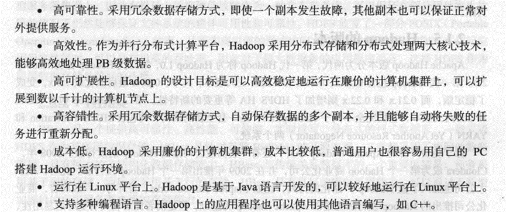

# 第二章

# 试描述Hadoop和谷歌的mapreduce,gfs等技术之间的关系。

Hadoo基于Java语言开发。核心是分布式文件系统(Hadoop Distributed File System,HDFS)和 MapReduce。

HDFS是针对谷歌文件系统(Google File System，GFS）的开源实现。

**MapReduce是针对谷歌 MapReduce的开源实现，**

# hadoop有哪些特性？

高可靠性，有效性，高可拓展性，高容错性，成本低，运行在linux平台，支持多种编程语言。

# 试列举单机模式和伪分布模式的异同点。

## 相同点：

### 运行机器数相同，
**运行机器数相同**，单机(非分布式)模式与伪分布式都是在一台单机上运行。

## 不同点：

### 运行模式不同：
单机模式是Hadoop的默认模式。这种模式在一台单机上运行，**没有分布式文件系统**，而是直接读写本地操作系统的文件系统。

伪分布模式这种模式也是在一台单机上运行，**但用不同的Java进程模仿分布式运行中的各类结点。**

### 启动进程不同：
单机模式下，
Hadoop不会启动NameNode，DataNode，TaskTracker等守护进程，
Map和Reduce任务作为同一个进程的不同部分执行

伪分布模式下，
Hadoop启动NameNodde，DataNode，JobTracker
TaskTracker这些守护进程
都在同一台机器上运行
是相互独立的Java进程。

### 配置文件处理方式不同
单机模式下，不对配置文件修改

伪分布模式下，修改3个配置文件，
core-site.xml hdfs-site.xml
mapred-site.xml 配置mapreduce集群的特性

### 节点交互不同
单机模式下，不需要与其他节点交互，单机模式不用hdfs，也不加载任何hadoop的守护进程，该模式主要用户开放调试mapreduce程序逻辑。
伪分布模式在单机模式下增加了代码调试功能，允许你检查内存使用情况，hdfs输入输出，以及其他的守护进程交互。
