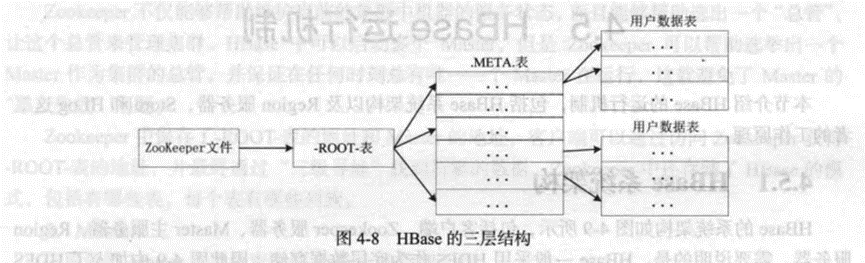

# 第4章_分布式数据库HBase

## 阐述HBase和传统关系数据库的区别

### 数据类型

关系数据库采用**关系模型**,Hbase采用**数据模型**. 

数据模型就是**把数据存储为未经解释的字符串**,

用户可以将不同格式的结构化数据和非结构化数据都序列化成字符串保存在HBase中,

然后通过自己的程序把字符串解析成不同的数据类型;

### 数据操作

关系数据库中会设计复杂的多表连接, HBase中经常只采用**单表的主键查询**

### 存储模式

关系数据库基于行存储, **HBase基于列存储**

## 分别解释HBase中行键 列族和时间戳的概念

### 行键

每个HBase表都由若干行组成, 每个行由行键(Row Key)标识, 在HBase内部,行键是字节数组. 存储时, 数据按照行键的字典序排序存储.

### 列族

列族需要在创建表的时候就定义好, 数量也不宜过多. 列族名必须由可打印字符组成, 创建表的时候不需要定义好列

### 时间戳

每个单元格保存着同一份数据的多个版本，这些版本采用时间戳进行索引。

使用不同的时间戳来**区分不同的更新版本**。

## 试述HBase各功能组件及其作用

**库函数**：链接到每个客户端

一个**Master主服务器**：主要负责表和Region的管理工作

许多个**Region服务器**：Region服务器是HBase中最核心的模块，负责维护分配给自己的Region，并响应用户的读写请求。

## 试述HBase的三层结构中各层次的名称和作用。

1. 第一层**Zookeeper**文件，**记录了-ROOT-表的位置信息**

2. 第二层**-ROOT-表**，记录了**META**表的Region位置信息，

   ROOT表只能有一个Region，通过ROOT表可以访问META表中的数据。

3. 第三层**META**表，记录了用户数据表的Region位置信息，**META表可以有多个Region**，保存了HBase中所有用户数据表的Region位置信息。

## 试述HBase系统基本架构以及每个组成部分的作用。

### 客户端

客户端包含访问HBase的接口，同时在缓存中维护着已经访问过的Region位置信息，用来加快后续数据访问过程。

### Zookeeper服务器

Zookeeper可以帮助选举出一个Master作为集群的总管，并保证在任何时刻总有唯一一个Master在运行，这就避免了Master的“单点失效”问题。

### Master

主服务器Master主要负责表和Region的管理工作：

管理用户对表的增删改查操等操作；

实现不同Region服务器之间的负载均衡；

在Region分裂或合并后，负责重新调整Region的分布；

对发生故障失效的Region服务器上的Region进行迁移。

### Region服务器

Region服务器是HBase中最核心的模块，负责维护分配给自己的Region，并响应用户的读写请求。

## 请阐述Region服务器向HDFS文件系统中读写数据的基本原理

Region服务器内部管理了一系列Region对象和一个HLog文件，

其中，HLog是磁盘上面的记录文件，它记录着所有的更新操作。

每个Region对象又是由多个Store组成的，

每个Store对应了表中的一个列族的存储。

每个Store又包含了MemStore和若干个StoreFile。

其中，MemStore是在内存中的缓存，

保存最近更新的数据。

StoreFile是磁盘中的文件，这些文件都是树结构，方便读取

**用户读写数据的过程**：当用户写入数据时，

会被分配到响应的Region服务器去执行操作，

用户数据首先被写入到MemStore和HLog中，

当操作写入HLog之后，commit调用才会将其返回给客户端。

当用户读取数据时，Region服务器会首先访问MemStore缓存，

如果数据不在缓存中，才会到磁盘上面的StoreFile中去寻找。

