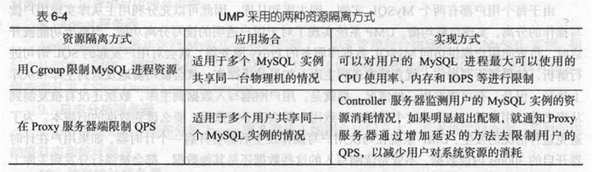

# 第6章_云数据库

# 云数据库有哪些特性？

动态可拓展

高可用性

较低的使用代价

易用性

高性能

免维护

安全

# UMP系统采用哪两种方式实现资源隔离？

<!--

用Cgroup限制MySQL进程，适用于多个MySQL共享物理机情况，可以限制CPU，内存和IOPS

在Proxy限制QPS，适用于多用户共享MySql的情况，服务器监测消耗情况，使用增加延迟方式限制用户QPS，减少用户对系统资源的消耗。

-->

# UMP系统是如何保障数据安全的？

## SSL数据库连接

SSL是为网络通信提供安全及数据完整性的一种安全协议

它在传输层对网络连接进行加密。

Proxy服务器实现类完成了MySQL客户端/服务器协议

可以与客户端之间建立SSL数据库连接。

## 数据访问IP白名单

可以把允许访问数据库的IP放入白名单，只有白名单内的IP地址才能方位，其他IP地址的访问都会被拒绝，总而进一步保证账户安全。

## 记录用户操作日志

用户的所有操作记录都会被记录到日志分析服务器，通过检查用户操作记录，可以发现隐藏的安全漏洞

## SQL拦截

Proxy服务器可以根据要求拦截多种类型的SQL语句，必须全表扫描语句`select *`

